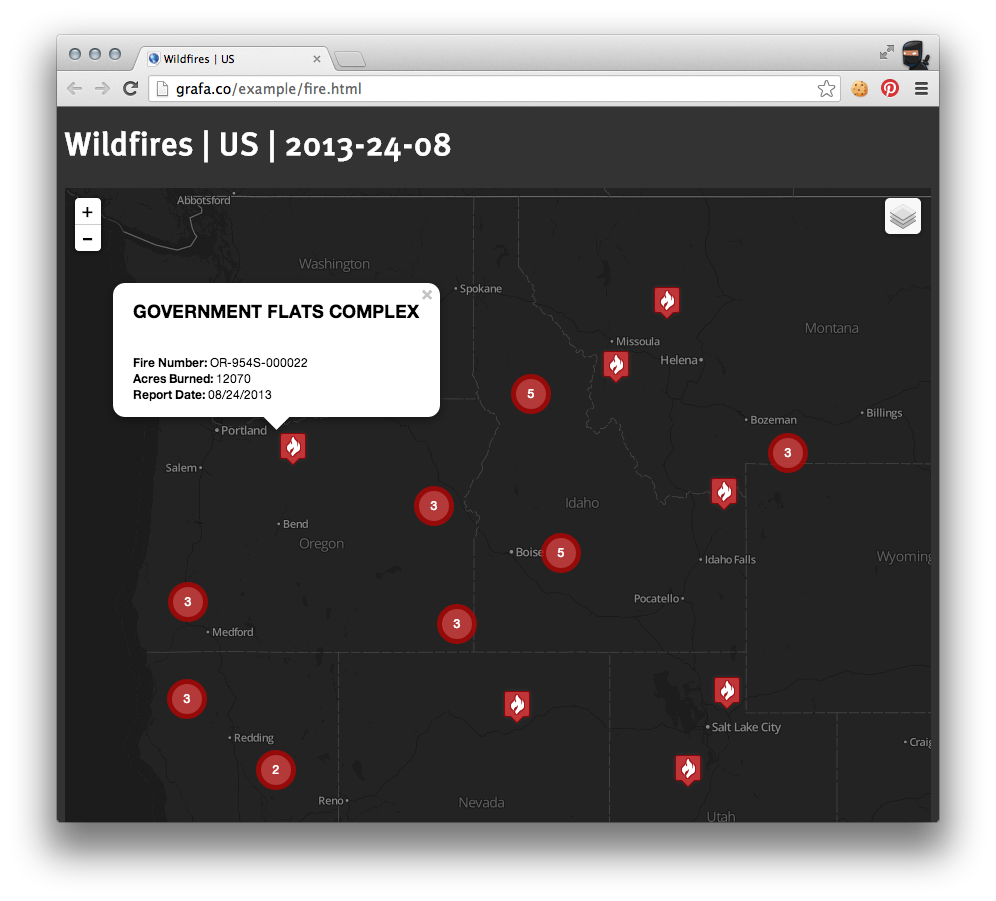

## Daily Wildfire Mapper

This example uses Leaflet javascript mapping library to read individual locations from an external geojson file. The file comes from csv list of current daily fires from this location: <http://activefiremaps.fs.fed.us/lg_fire2.php#>. Still working on a converter for the csv to json.